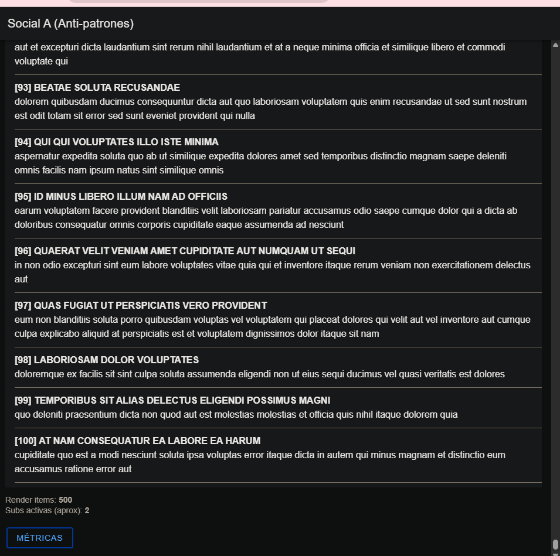
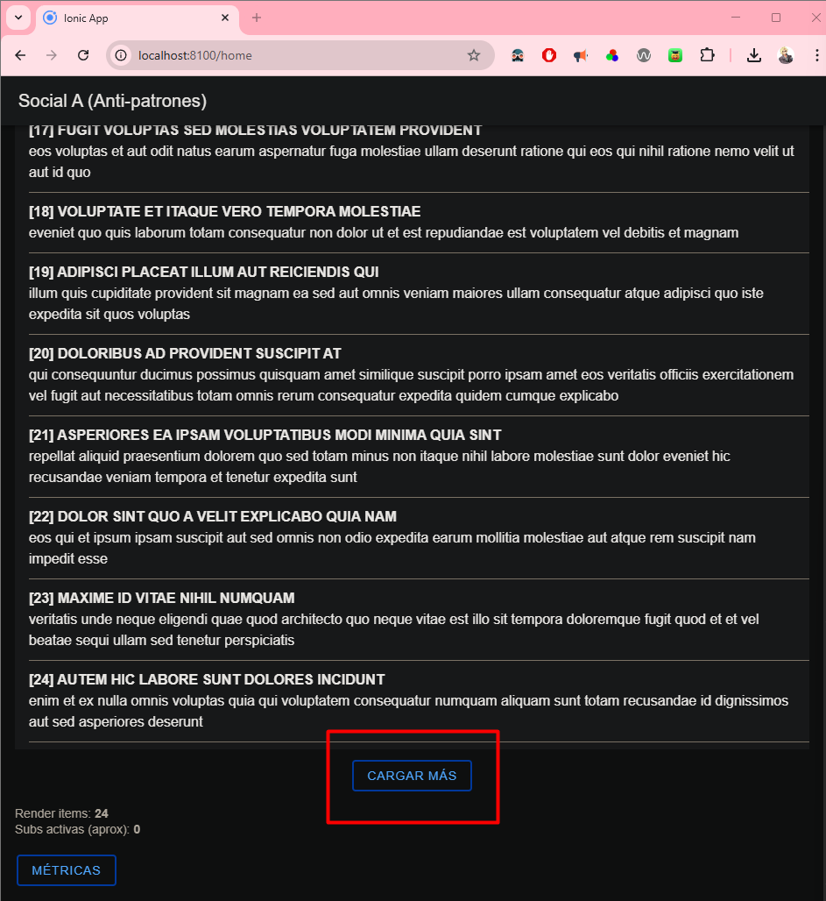
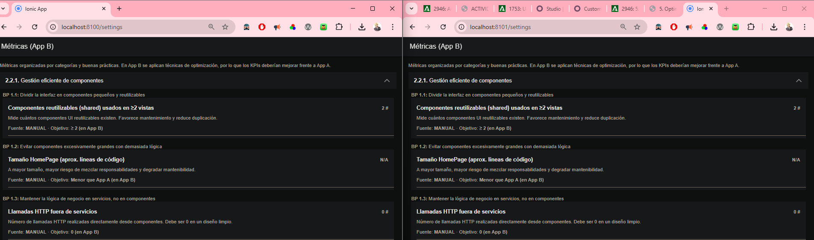
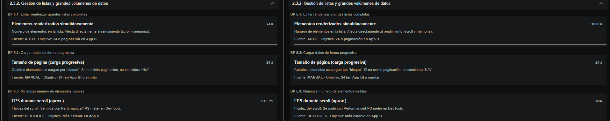
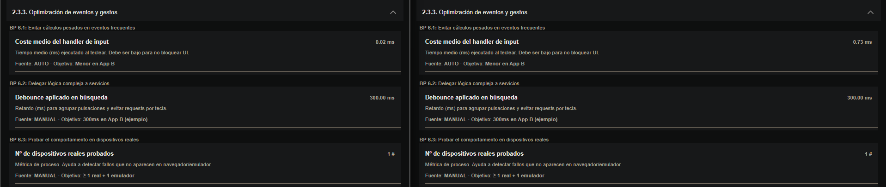
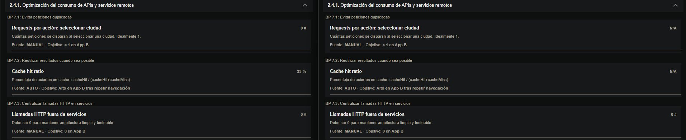
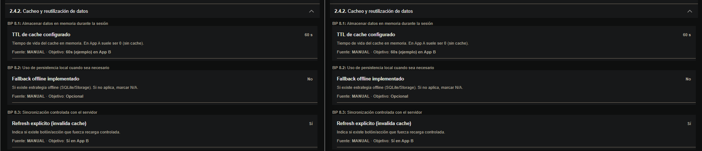
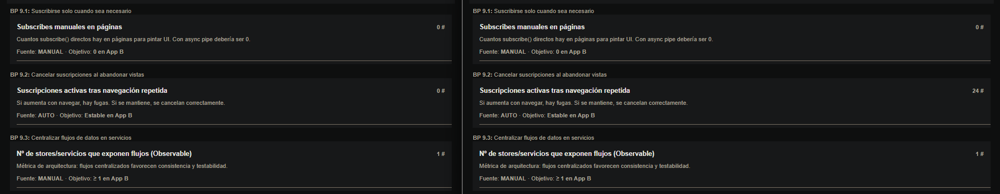

# Red Social – Comparativa de KPIs (Antes vs Ahora)

Este documento recoge la comparativa de métricas clave (KPIs) entre la versión inicial con malas prácticas (App A) y la versión optimizada tras aplicar las secciones 2.2.1 → 2.4.3 (App B). Incluyo plantillas de imágenes para que sustituya con mis capturas de DevTools y la página de Métricas.

## Objetivo

- Reducir trabajo innecesario en cambio de detección y eventos.
- Evitar peticiones HTTP duplicadas y reutilizar datos con cache TTL.
- Controlar el tamaño de listas visibles y estabilizar el scroll.
- Centralizar flujos en servicios y eliminar subscribes manuales en páginas.

## Qué he cambiado

- Servicio con cache en memoria + TTL (60s) y deduplicación de requests.
- Páginas `Home` y `Detail` en modo OnPush, con async pipe y `trackBy`.
- Búsqueda con `debounceTime(300)` y sin trabajo costoso por tecla.
- Lista paginada: 24 elementos iniciales, botón “Cargar más”.
- Botón de “Refrescar” que invalida cache (sin disparar requests duplicadas).

Rutas ya estaban en lazy (`loadComponent`), se mantienen.

## Cómo medir (pasos y capturas)

1) Inicio en frío y bundle inicial: DevTools → Network, filtrar `*.js`, anotar KB iniciales.
2) Home sin interactuar: Métricas → comprobar `renderItems`, `activeSubscriptions`.
3) Escribir en el buscador: Performance → medir coste medio por pulsación, confirmar que hay `debounce` y que no hay múltiples HTTP por tecla.
4) Navegar Home → Detail → Home (dos veces): Network → contar requests; Métricas → `cacheHit`, `cacheMiss`, `cacheHitRatio`.
5) Pulsar “Cargar más”: verificar que `renderItems` sube por tramos y el scroll sigue fluido.

Sustituir las imágenes de referencia por las capturas reales:




EL CAMBIO PRINCIPAL ES QUE AHORA TIENE LO DE CARGAR MÁS Y ASÍ SE VAN A IR CARGANDO POCO A POCO LOS POSTS Y NO VA A CONSUMIR TODO



DONDE PONE N/A PUES EN LA DE MALAS PRÁCTICAS HAY 43 LINEAS EN HOMEPAGE Y EN BUENAS PRACTICAS 49 


COMO SE PUEDE APRECIAR EN LA IMAGEN, LAS PETICIONES TOTALES DISMINUYEN EN LA APP DE BUENAS PRACTICAS (IZQUIERDA), LAS SUBS ACTIVAS SON ESTABLES Y LUEGO LOS ELEMENTOS RENDERIZADOS, AL USAR LA APLICACIÓN DE BUENAS PRÁCTICAS UN BOTÓN DE CARGAR, VA CARGANDO DE 24 EN 24, NO SE LE HA DADO AL BOTÓN ASI QUE SE HA RENDERIZADO 24 EN PREVISIÓN, SIENDO MENOR A LOS 1000 DE LA APP DE MALAS PRÁCTICAS DONDE SE RENDERIZAN LOS 1000 DE GOLPE HACIENDO QUE VAYA PEOR LA PÁGINA.



SE PUEDE APRECIAR QUE LOS ELEMENTOS RENDERIZADOS SON MENOR EN LA APP CON LAS BUENAS PRÁCTICAS APLICADAS YA QUE COMO HE DICHO ANTES, HE USADO LO DEL BOTÓN DE CARGAR MÁS, EL TAMAÑO DE LA PÁGINA ES IGUAL Y LOS FPS POR SCROLL SON 61 FPS.



SE PUEDE APRECIAR COMO EN LA PÁGINA DONDE ESTÁN LAS BUENAS PRÁCTICAS APLICADAS, AL ESCRIBIR EN EL BUSCADOR UN POST, SE TARDA MUCHO MENOS QUE EN EL OTRO QUE ESTÁN TODOS RENDERIZAZDOS.



SE APRECIA EN LA IMAGEN COMO EN LA DE LAS BUENAS PRÁCTICAS SE MIDE CORRECTAMENTE EN EL OTRO NO Y DA PROBLEMAS





## Resumen de KPIs (dirección del cambio)

> Nota: algunos valores son manuales o dependen del dispositivo. Indico tendencia esperada y dónde capturar la evidencia.

| KPI | Antes (App A) | Ahora (App B) | Evidencia |
|---|---|---|---|
| startupMs | ≈ similar | ≈ similar | Métricas/`startupMs` |
| initialJsKb | ≈ | ≈ (rutas ya lazy) | DevTools/Network |
| lazyRoutesCount | 3 | 3 | Métricas (manual) |
| httpRequests | Alto (duplicadas por inicio y búsqueda) | ↓ Notable (1 fetch + cache, sin duplicadas) | Network y `httpRequests` |
| cacheHit | 0 | ↑ Alto tras repetir navegación | Métricas/`cacheHit` |
| cacheMiss | Alto en primer acceso | ↓ Bajo al repetir | Métricas/`cacheMiss` |
| cacheHitRatio | N/A o Bajo | ↑ Alto | Métricas/`cacheHitRatio` |
| activeSubscriptions | ↑ Crecía con subscribes manuales | ↓ Estable y bajo (async pipe) | Métricas/`activeSubscriptions` |
| avgInputHandlerMs | Alto (trabajo pesado por tecla) | ↓ Bajo (debounce + trabajo ligero) | Performance |
| renderItems | Muy alto (lista inflada) | ↓ 24 iniciales (paginado) | Métricas/`renderItems` |
| pageSize | N/A | 24 | Ajuste manual + código Home |
| httpOutsideServices | 0 | 0 | No hay `HttpClient` en páginas |
| manualSubscribesInPages | 2+ | 0 | Revisión de código / Métricas |
| storesCount | 1 | 1 | Catálogo (manual) |
| ionicUiRatio | ≈ | ≈ | Revisión visual (manual) |

## Mapeo a las buenas prácticas

**2.2.1 Gestión eficiente de componentes**
- OnPush en `Home` y `Detail` para minimizar CD.
- Funciones de plantilla baratas y `trackBy` en listas.
- Lógica de negocio y datos centralizados en servicios.

**2.2.2 Lazy loading**
- Se mantienen rutas `loadComponent`; arranque sin cargar pantallas no usadas.

**2.2.3 Servicios y estado compartido**
- Cache con TTL (60s), reutilización de resultados y `invalidateAll()` para refresh controlado.
- Sin `HttpClient` en componentes.

**2.3.1 Uso eficiente de componentes Ionic**
- Listas `ion-list` con `trackBy` y plantillas ligeras.

**2.3.2 Listas y grandes volúmenes**
- Paginación simple (24) y botón “Cargar más”.
- Menos elementos simultáneos → menor memoria y mejor scroll.

**2.3.3 Eventos y gestos**
- `debounceTime(300)` en búsqueda y eliminación de trabajo costoso por tecla.

**2.4.1 Consumo de APIs**
- Eliminadas peticiones duplicadas, una única lectura cacheable.

**2.4.2 Cacheo y reutilización**
- `shareReplay` con `windowTime` (TTL) para deduplicar y reutilizar datos.
- `refresh()` invalida cache de forma explícita.

**2.4.3 Observables y suscripciones**
- Async pipe en vistas, sin `subscribe()` manual en páginas.
- KPIs de suscripciones estables tras navegar.

## Archivos relevantes

- Servicio con cache: `redSocialBuenasPracticas_lgomdom/src/app/core/services/social-bad.service.ts`
- Home OnPush + async pipe + paginación: `redSocialBuenasPracticas_lgomdom/src/app/pages/home/home.page.ts` y `home.page.html`
- Detail OnPush + async pipe: `redSocialBuenasPracticas_lgomdom/src/app/pages/detail/detail.page.ts` y `detail.page.html`
- Ajuste de “Refrescar” (invalidación de cache): `redSocialBuenasPracticas_lgomdom/src/app/pages/settings/settings.page.ts`

## Cómo ejecutar y medir

```powershell
npm install
ionic serve
```

- Página de Métricas: navegar a Settings/Métricas para ver KPIs auto y manuales.
- DevTools Network/Performance para las capturas de bundle inicial, requests y coste de input.